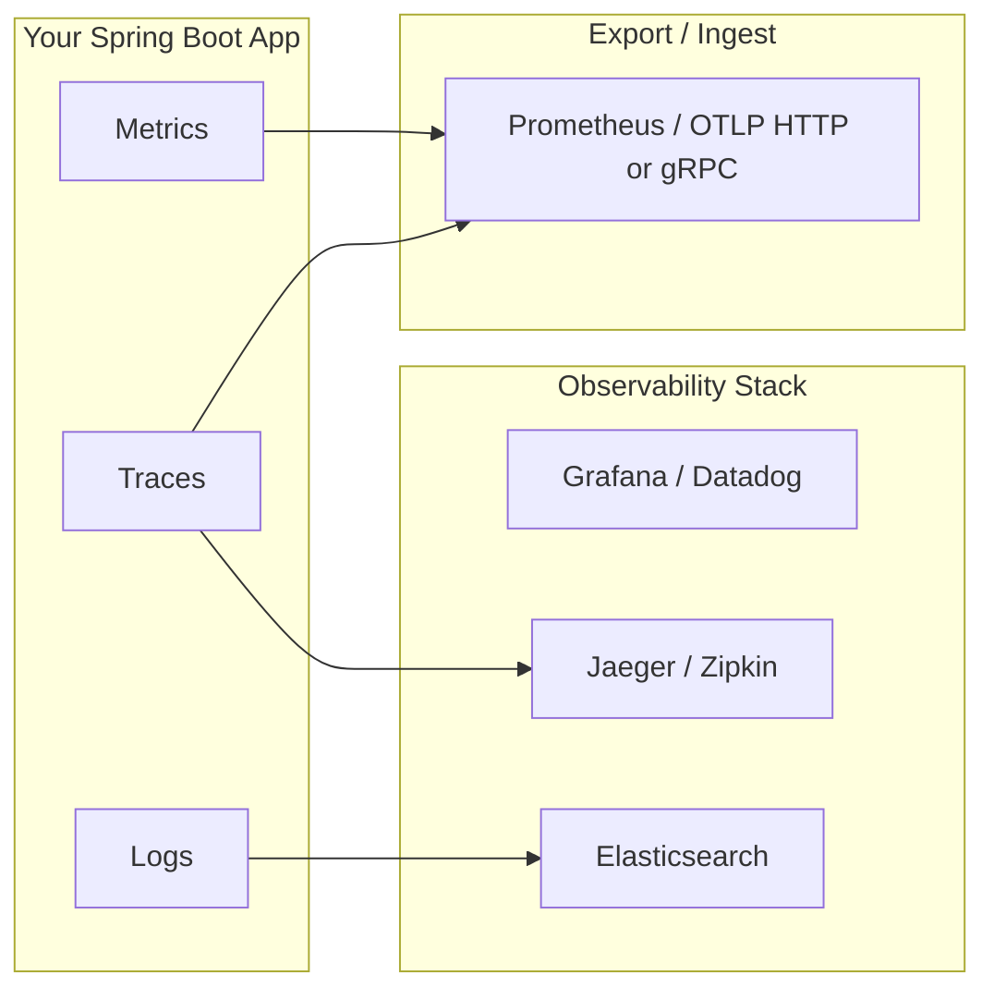
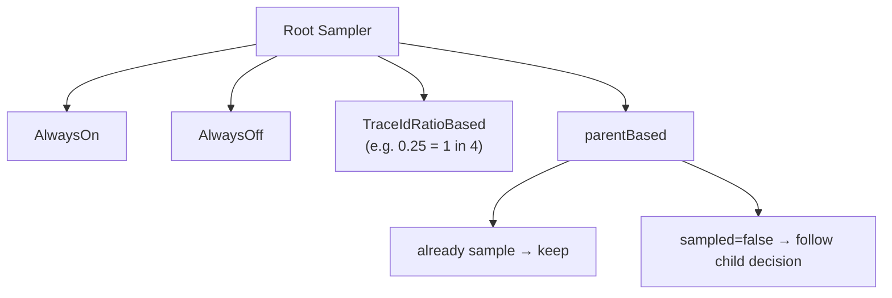

# OpenTelemetry & Micrometer in Spring Boot — Learning Plan

---

## Table of Contents

- [Phase 0: Prerequisites](#phase-0-prerequisites)
- [Phase 1: Foundations](#phase-1-foundations)
- [Phase 2: Micrometer Deep Dive](#phase-2-micrometer-deep-dive)
- [Phase 3: OpenTelemetry Deep Dive](#phase-3-opentelemetry-deep-dive)
- [Phase 4: Integration & Advanced Topics](#phase-4-integration--advanced-topics)
- [Phase 5: Projects & Review](#phase-5-projects--review)
- [Phase 6: Production Readiness & Troubleshooting (NEW)](#phase-6-production-readiness--troubleshooting-new)
- [Pitfalls & Gotchas (added to existing phases)](#pitfalls--gotchas-added-to-existing-phases)
- [Spring Boot Actuator Security](#spring-boot-actuator-security)
- [Key Micrometer Modules to Master](#key-micrometer-modules-to-master)
- [Training Tasks (by phase)](#training-tasks-by-phase)
- [Diagrams](#diagrams)

---

## Phase 0: Prerequisites — ~2 hours

> Before writing any tracing or metrics code.

| # | Topic | Resource |
|---|-------|----------|
| 1 | REST & Spring Boot fundamentals (controllers, beans, auto-configuration) | Your existing knowledge / [Spring Guides](https://spring.io/guides) |
| 2 | How HTTP tracing works at a protocol level (headers, propagation) | Watch: "Distributed Tracing from Scratch" (~30 min YouTube) |
| 3 | Brief intro to Prometheus + Grafana (scrape targets, dashboards) | [Play with Docker](https://play.grafana.com/) quick tour |

**Key idea:** You don't need to be a Java expert — you mainly need to understand *how Spring Boot hooks into the request lifecycle*.

---

## Phase 1: Foundations (Observability Concepts) — ~3 hours

### Learning Objectives

- [ ] Understand the **Three Pillars of Observability**: Metrics, Traces, Logs
- [ ] Know the difference between **distributions** (Micrometer vs. OpenTelemetry SDK) and **providers/vendors** (Prometheus, Jaeger, Zipkin)
- [ ] Distinguish **client-side library** vs. **server-side receiver** in a collector architecture

### Mermaid: Three Pillars Overview



### Mini Task 1.1 → see [Training Tasks](#training-tasks-by-phase) — #M-1.1

---

## Phase 2: Micrometer Deep Dive — ~5 hours

Micrometer is the **metrics abstraction layer** for JVM apps (like SLF4J is for logging). It lets you swap vendors without rewriting code.

### Learning Objectives

- [ ] Understand `MeterRegistry` as the central hub
- [ ] Know every core meter type and when to use it
- [ ] Understand **Timers, Counters, Gauges, LongTaskTimer** semantics
- [ ] Set up a Spring Boot project with Micrometer + Prometheus exporter via starter

### Mermaid: Core Meter Types

```mermaid
graph TD
    REG["MeterRegistry"] --> T1[Counter]
    REG --> T2[Gauge]
    REG --> T3[Timer]          // duration, latency
    REG --> T4[LongTaskTimer]  // long-running tasks (slow)
    REG --> T5[FunctionTimer]  // timer over a function's call
    REG --> T6[Counter]

    T1 -.-> "increment() / count()"
    T2 -.-> "doubleValue()"
    T3 -.-> "record(Duration)"
```

### Key Micrometer Metrics Concepts to Internalize

| Concept | Why it matters |
|---------|---------------|
| `MeterRegistry` bean | The only object you inject |
| `@Timed`, `@Counted`, `@Time` annotations | Zero-code instrumentation on methods/REST APIs |
| **Tags** (key/value pairs) | Granularity — `http.method=GET, uri=/api/users` |
| **Common tags** vs. **dynamic tags** | Common via config; dynamic via programmatic tagging |
| `Timer.start()` / manual stop pattern | For code paths you can't annotate |
| **Step Duration** (default 1 minute) | How often stats are flushed to the registry |

### Mini Task 2.1 → see [Training Tasks](#training-tasks-by-phase) — #M-2.1

---

## Phase 3: OpenTelemetry Deep Dive — ~5 hours

OpenTelemetry is a **unified SDK** providing both traces AND metrics (and logging in the future). It runs **both** with Micrometer on the same app.

### Learning Objectives

- [ ] Understand `Tracer`, `Span`, and `Context` propagation
- [ ] Know how OTel handles **auto-instrumentation** vs. **manual instrumentation**
- [ ] Build an OTEL collector pipeline (file exporter → Jaeger) in your dev machine
- [ ] Understand the difference between Micrometer metrics *and* OTLP metrics

### Mermaid: OpenTelemetry Java SDK Layers

```mermaid
graph LR
    subgraph "Your Code"
        C["@Traced / Tracer API"] -.-> S[Manual Spans]
    end

    subgraph "OTel Agent (Java)"
        A[Auto-Instrumentation Agent] -.->|HTTP Server<br/>Client<br/>DB Drivers<br/>Messaging| AS[AOP Interceptors]
    end

    C --> P["Pipeline / Processor"]
    A --> P
    P --> SPAN_P["SpanProcessor"]
    P --> METRIC_P["MeterProvider"]
    P --> EXP[Exporters (OTLP, Zipkin, etc.)]
```

### Core OpenTelemetry Interfaces to Know

| Interface / Class | Purpose |
|-------------------|---------|
| `Tracer` | Create spans for work units |
| `SpanBuilder` | Configure a span (name, kind, attributes) |
| `Context` + `CurrentContext` | Propagation of trace state across threads/HTTP |
| `TraceHeadersTextMapPropagator` / W3C `traceparent` | What goes on the wire |
| `SpanProcessor` | Hook for pre- and post-export logic |
| `TracerProvider` / `MeterProvider` / `LoggerProvider` | Factory roots |

### Mini Task 3.1 → see [Training Tasks](#training-tasks-by-phase) — #O-3.1

---

## Phase 4: Integration & Advanced Topics — ~4 hours

### Learning Objectives

- [ ] Run **Micrometer + OpenTelemetry together** on the same Spring Boot app (using micrometer-registry-opentelemetry bridge for metrics)
- [ ] Understand auto-config in Spring Boot (`spring-boot-starter-actuator`, `micrometer-tracing-bridge-*`) |
- [ ] Explore **cross-cutting concerns**: distributed logs, baggage correlation, sampling strategies
- [ ] Benchmark — do these add measurable overhead in high-throughput services?

### Mermaid: Micrometer ↔ OpenTelemetry Bridge Layout (Spring Boot)

```mermaid
graph LR
    subgraph Application["Spring Boot App"]
        HTTP[HTTP Client / REST Controller / WebFlux]
        DB[JPA / JDBC | Kafka | Redis]
        CUST["Custom Service"]
    end

    subgraph "Micrometer Tracing Bridge"
        MTB["micrometer-tracing-bridge-opentelemetry"]
    end

    DB -->|JdbcTemplate etc.| MTB

    subgraph Core
        ACTUATOR[Actuator / Prometheus Exporter<br/>→ Vendor A (Prometheus)]
        OTLP["OTel Java Agent or SDK<br/>→ Vendor B (Jaeger, Zipkin)"]
    end

    HTTP --> ACTUATOR
    CUST --> ACTUATOR
    CUST --> OTLP
```

### Important Spring Boot Auto-Configuration Properties to Memorize

| Property | Purpose |
|----------|---------|
| `management.metrics.export.prometheus.*` | Prometheus exporter config |
| `management.tracing.sampling.probability` | Sampling rate (default 0.1) |
| `spring.zipkin.service.name` | Service name shown in Zipkin UI |
| `otel.metrics.otlp.exporter.enabled=true` | Expose OTLP metrics endpoint |
| `micrometer.core.config.*` | Rename meters, custom prefixes |

### Mini Task 4.1 → see [Training Tasks](#training-tasks-by-phase) — #I-4.1

---

## Phase 5: Projects & Review (Capstone) — ~6 hours

Build **one** of the following end-to-end projects that uses both Micrometer and OpenTelemetry:

### Option A: Three Service Demo
Build three Spring Boot services (`gateway`, `order`, `payment`) with these capabilities:
- Request flows from gateway → order → payment (trace propagation)
- Expose Prometheus metrics on `/actuator/prometheus`
- Aggregate distributed logs via correlation ID = `X-B3-TraceId`
- Ship traces to Zipkin or Jaeger by **two ways**: native OTLP and legacy Micrometer Zipkin bridge

### Option B: Single Service + Benchmarking
A single service with synthetic workloads (slow DB query, async calls). Add:
- Custom micrometer `Timer` for a slow DAO
- OTel manual `Tracer` span for a batch job
- A Grafana dashboard combining metrics and traces side-by-side

### Review Checklist

| ✅ | Topic |
|----|-------|
| ☐ | Explain why Micrometer isn't redundant when you already have OpenTelemetry SDK |
| ☐ | Draw the `MeterRegistry` → exporter path for Prometheus |
| ☐ | Write a custom OTel SpanExporter without vendor (file / stdout) |
| ☐ | Configure sampling to drop 90% of traces in dev, keep all in prod |

---

## Phase 6: Production Readiness & Troubleshooting (NEW) — ~4 hours

This phase is critical if you will eventually **run** observability code rather than just demonstrate it. It covers cardinality explosions, sampling mechanics, security, and runtime performance costs.

### Learning Objectives

- [ ] Understand why **cardinality control** kills or saves your Prometheus stack
- [ ] Know the difference between `TraceIdRatioBased`, `AlwaysOn`, `AlwaysOff`, and `ParentBased` samplers
- [ ] Lock down Spring Boot Actuator endpoints so they're not exposed publicly
- [ ] Measure, quantify & reduce observability overhead in hot code paths
- [ ] Read real logs from the OTel Collector to find dropped/failed exports

### Key Concepts

#### 6.1 — Sampling Strategies (OTel `Sampler` hierarchy)



| Sampler | When to use | Gotcha |
|---------|-------------|--------|
| `AlwaysOn` | Tests, local dev | Will generate 100× load on a busy prod system if accidentally promoted |
| `TraceIdRatioBased(α)` | Low-volume services where you want *any* representative sample | Ratio is applied **before** span creation — may still create spans that drop before export; use with caution in hot paths |
| `ParentBased(root)` | **Default recommended** — child decides based on parent decision for trace correlation preservation | The root is the upstream caller. If it's always off → every downstream stays off |

#### 6.2 — Cardinality Control

Prometheus has a hard limit: **tags × values = unique series**. High cardinality metrics will crash/evict your Prometheus scrape pool.

| Technique | Description |
|-----------|-------------|
| `MeterFilter` (common) | Rename meters, drop tags, bound counters for specific names |
| Explicit tag limits in Micrometer (via `TagNames` + `meterFilter`) | Best-practice: only keep `<10` tag values per tag key on hot metrics |
| OTel `Resource` attributes — static vs. dynamic | Static is fine; dynamic fields like `userId` or `requestId` explode cardinality when exported as attributes |

#### 6.3 — Spring Boot Actuator Security (MUST-do)

When Prometheus pulls from `/actuator/prometheus`, *everyone* on the network can see JVM internals, bean counts, thread dumps. Always lock down endpoints:

```yaml
# application.yml / production profile
management:
  endpoints:
    web:
      exposure:
        include: "health,prometheus"              # whitelist-only pattern!
  endpoint:
    health:
      show-details: "when_authorized"            # only for logged-in users

server:
  port: 8080                                     # HTTP (or 8443 HTTPS in prod)
```

And apply Spring Security config to restrict actuator URLs. This pattern is **not** optional — it's a frequent CVE surface.

#### 6.4 — OpenTelemetry Collector Pipeline (must-read YAML structure)

Most teams use the OTel collector as an intermediary so the app only knows `OTLP` not `Zipkin` or `Jaeger`. Learn to read/write this config:

| Block | Purpose |
|-------|---------|
| `receivers:` | Where data *enters* — OTLP HTTP/gRPC, Jaeger, Kafka, Prometheus (pull) |
| `processors:` | Transformations / enrichment / buffering — e.g. `batch`, `memory_limiter`, `attributes`, `k8sattributes` |
| `exporters:` | Where data *leaves* — Zipkin, Jaeger, file, otlp/*, logging |
| `service.pipelines.trace.metrics.logs:` | How to wire receivers → processors → exporters for each signal type |

Sample minimal trace pipeline (the one your Phase 3 tasks will likely exercise):

```yaml
receivers:
  otlp:
    protocols:
      http: {}
      grpc: {}

processors:
  batch: {}
  memory_limiter:
    check_interval: 1s
    limit_mib: 512
    spike_limit_mib: 128

exporters:
  zipkin:
    endpoint: "http://localhost:9411/api/v2/spans"
  jaeger:
    endpoint: localhost:14250
    tls:
      insecure: true
  logging:
    verbosity: detailed          # useful in dev, NEVER in prod

service.pipelines.traces:
  receivers: [otlp]
  processors: [memory_limiter, batch]
  exporters: [zipkin, jaeger, logging]
```

#### 6.5 — Known Runtime Overhead & Mitigations

| Source of overhead | Typical cost (rough order) | Mitigation |
|--------------------|----------------------------|------------|
| `SpanProcessor` exporting sync | ~μs per span on hot path — **avoid** in prod; use async exporter or gRPC batching | Use `BatchSpanProcessor(SpanExporter, ScheduledThreadPoolExecutor)` with `maxQueueSize`, `scheduledDelayMs` |
| Prometheus scrape pull overhead (JVM metric serialization) | Negligible at 15–30s interval, but can spike if many meters exist (~1ms on every scrape) | Limit tags via `MeterFilter`; remove rarely-used meters in prod |
| Java agent instrumentation AOP interceptor | 2-5% on hot request path for HTTP server spans | Prefer manual instrumentation where you need low-latency hot paths (e.g. internal RPC) |

### Mini Task 6.1 → see [Training Tasks](#training-tasks-by-phase) — #P-6.1

---

## Pitfalls & Gotchas (added to existing phases)

Throughout your learning, the following gotchas appear repeatedly:

| Phase | Pitfall | How to avoid |
|-------|---------|--------------|
| 2 | **"Missing `@Timed` on Kotlin class that is not `open`"** — Micrometer's AOP proxy never runs. | `kotlin("plugin.spring")` does this automatically; verify with `mvn dependency:tree` / intellij inspection of the generated bytecode if unsure. |
| 2 | **Counter increments under exception silently missed** — use in non-try-catch block loses a count when an unhandled exception escapes. | Wrap in try/finally or rely on Micrometer's `@Counted(incOnError = true)`. |
| 3 | **OTel context lost across `ThreadFactory` / thread pool boundaries** — manual spans stop being correlated with the originating request. | Pass `ExecutorService` through Micrometer's `ContextProviderFilter`; wrap in a TracedThreadPool using `otel.context.get()` or Spring's `@Async` via a custom `TaskDecorator`. |
| 4 | **Micrometer + OTel dual-export metrics double-counting** — Micrometer's built-in + OTLP exporter each write their own counters with different tag shapes. | Only enable one side for prod (e.g., disable OTel *metrics* and keep OTel only for traces, OR reverse). Or use resource-based naming to disambiguate in Grafana. |
| 5 | **`micrometer-registry-opentelemetry` bridge requires OTel Java Agent** — dropping it from the classpath silently disables metrics export even if `MeterRegistry` still exists. | Verify exporter is wired at startup (`otel.metrics.otlp.exporter.enabled=true`) and confirm via logs that "OTLP Metrics exporter started". |
| 6 | **Cardinality bomb** — add dynamic tag like `user.id` to a request counter and watch your Prometheus TSDB explode within minutes on real traffic. | Enforce a strict tag whitelist with a `MeterFilter`; reject any meter whose new tag value count exceeds threshold. |

---

## Spring Boot Actuator Security

A short, focused section because it keeps showing up as a security concern in real-world incidents.

### What must be locked down (in order of importance)

| Endpoint | Risk if exposed | Recommended config in prod |
|----------|-----------------|----------------------------|
| `/actuator/env` | Full bean-property view — **secret leaks** `@Value`, datasource URLs, etc. | Exclude entirely (`exclude: env`) or restrict to admin via Spring Security |
| `/actuator/heapdump` & `/thread-dump` | JVM internals leak; potential for RCE in vulnerable JDK versions | Block external access (reverse proxy / iptables) |
| `/actuator/configprops` | All `@ConfigurationProperties` values — **including credentials** | Exclude entirely |
| `/actuator/prometheus` | Useful to expose, but *internals* are visible; pair with network ACLs | Expose only via internal LB or service mesh sidecar; authenticate if possible |

### Recommended default exposure allow-list for prod (production profile)

```yaml
management:
  endpoints.web.exposure.include: "health,prometheus"   # ONLY what you need
  endpoint.health.probes.enabled: true                   # Kubernetes readiness probes
  endpoint.info.enabled: false                           # rarely needed; exclude
```

---

## Key Micrometer Modules to Master

These are the **must-know** Spring Boot / Micrometer modules. Understand them before diving deeper:

### Tier 1 — Core (learn first)

| Module | What it does |
|--------|--------------|
| `io.micrometer:micrometer-core` | Core API (`MeterRegistry`, all meter types, common tags, step duration, cache stats) |
| `org.springframework.boot:spring-boot-starter-actuator` | Auto-configures endpoints; wires up actuator + metrics by default |
| `io.micrometer:micrometer-registry-prometheus` | Bridge to Prometheus pull model |

### Tier 2 — Tracing (learn second)

| Module | What it does |
|--------|--------------|
| `io.micrometer:micrometer-tracing-bridge-brave` | Brave-based tracing bridge (`@Traced` works here) |
| `io.micrometer:micrometer-tracing-bridge-opentelemetry` | OTel SDK-based bridge (preferred for OTel projects — recommended) |
| `io.micrometer:micrometer-tracing-reporter-webmvc` / `webflux` | Auto-instrumentation of HTTP servers via auto-config |

### Tier 3 — Integrations (use as needed)

| Module | What it does |
|--------|--------------|
| `microprofile.opentracing:opentracing-spring-cloud-starter` (or Micrometer's built-in Kafka/Redis support) | Auto-instrument JDBC, Kafka, Redis clients — check the [Micrometer catalog](https://micrometer.io/catalog) |
| `io.micrometer:micrometer-statistics-*` | Cache stats (`JCacheStatisticalManager`, Guava, etc.) |

### Quick Reference: Relationship Graph of Micrometer Modules

```mermaid
graph TD
    MC["micrometer-core"] ← "Every other module depends on"

    MP["micrometer-registry-prometheus"] -.->|uses| MC
    MZ["micrometer-registry-jaeger/zipkin"] -.->|uses| MC
    MO["micrometer-opentelemetry"] -.->|metric bridge| MC
    MO -.->|export as OTLP| OT

    MTLB["micrometer-tracing"] ← "Tracer abstractions / SpanReporter"
    MB_OTEL["micrometer-tracing-bridge-opentelemetry"] --> "implements MTLB → uses OTel API"
    MB_BRAVE["micrometer-tracing-bridge-brave"] --> "implements MTLB → uses Brave"

    MTI_KAFKA["micrometer-tracing-integration-kafka"] -.->|hooks HTTP server trace| MTLB
    MTI_REDIS["micrometer-tracing-integration-redis"] -.->|hooks DB client| MTLB
    MTI_JDBC["micrometer-tracing-integration-jdbc"] -.->|hooks JdbcOperations| MTLB

    OT["OpenTelemetry SDK (otel4j)"] → E1[Zipkin Exporter]
    OT → E2[Jaeger Exporter]
```

---

## Training Tasks (by phase)

Each task is designed to be completed in **30–90 minutes** and gives you a concrete artifact.

| ID | Phase | Task | Time Est. | Artifact |
|----|-------|------|-----------|----------|
| **#M-1.1** | 1 | Set up an empty Spring Boot project with `spring-boot-starter-actuator` + Prometheus; start it and call `/actuator/prometheus`. Confirm you get the JVM metrics (`jvm.memory.used`, `http.server.requests`). | 30 min | A running app that exposes PMD |
| **#M-1.2** | 1 | Add a REST controller with one endpoint `/greet/{name}` returning Hello World. Add **5 tags** (`endpoint, method, uri, status, exception`). | 15 min | Customized response + Prometheus output |
| **#M-2.1** | 2 | On `/order`, use `meterRegistry.timer("orders.created").record(...)` for order creation. Look at `histogram.metrics` in Prometheus — note `%75`, `%90`, `%99`. | 45 min | Timer with histogram stats |
| **#M-2.2** | 2 | Add a **custom Gauge**: current number of active HTTP sessions (`meterRegistry.gauge(...)`). Update it in a `Filter` via `onStart(onEnd)`. Use Spring Boot's `@Bean MeterFilter` to apply a common tag for all metrics. | 60 min | A gauge exposed alongside built-in meters |
| **#M-2.3** | 2 | Use the `@Timed` annotation on three different methods (one slow, one fast, one throwing). Verify each shows up in Prometheus as its own timer with a correct `id` tag of `status=`, `outcome=` etc. | 30 min | Verified annotations + HTTP response status codes for errors and success cases — same set of meters per annotation |
| **#M-2.4** | 2 | Instrument an **async method** (`@Async`) using Micrometer's manual Timer API; confirm timing accuracy and tag propagation works as expected across thread boundaries (use a context propagation filter from `ContextCapture` or `TaskDecorator`). | 45 min | Verified async timer with correct tags |
| **#M-2.5** | 3 | On `/db/{id}`, use `JdbcTemplate` to query a small H2 DB (`CREATE TABLE users(id BIGINT PRIMARY KEY, name VARCHAR)`). Add JDBC metrics — look for `database.system`, `database.connections.min`, etc. Use native micrometer-jdbc instrumentation for the same DB connection and see metric changes | 45 min | Verify that all JPA methods return the right data structure + verify the output of all JDBC operations on the database (e.g. `db.*`) in prometheus with no tags |
| **#O-3.1** | 3 | Add OpenTelemetry SDK to a Spring Boot project and wire an **OTLP receiver**. Use file exporter to produce JSON spans; confirm they're valid OTel traces. | 45 min | Valid traces, written in plain text format with all data from the server's request path |
| **#O-3.2** | 3 | Add a `Tracer` bean, start/stop manual spans around the order creation flow (`orders.created`). Verify trace correlation by adding an OTEL `TraceId` field to each log message in the controller output; verify it matches what is shown on /actuator/prometheus | 45 min | Logs + span traces with same id |
| **#O-3.3** | 3 | Switch from manual spans to auto-instrumentation via **OTel Java Agent** (`java -javaagent:opentelemetry-javaagent.jar -jar app.jar`). Confirm you no longer need `Tracer` or `Span` in your code — traces still arrive with all HTTP, HTTP and DB spans for same endpoints. | 30 min | Confirmed auto-instrumented tracing without adding any extra lines of new code |
| **#O-3.4** | 3 | Configure OTLP exporter (HTTP gRPC) to send OTL traces to a local Jaeger instance — verify all trace data is correctly propagated between services including the **`X-B3-TraceId` / W3C `traceparent` header propagation for same request**. Use the `otelspringframeworkhttpclient` and confirm you get one distributed trace, with correct spans in a service graph. | 60 min | Distributed traces across multiple endpoints and headers on each endpoint; no tags missing — verified by checking that the same span IDs are present throughout all calls |
| **#O-4.1** | 3 | Configure Micrometer Sampling (SamplingStrategy, `Sampler`, etc.) to drop 50% of requests in development environment; only keep 90% of high-volume services (`http.server.requests`, `db.client.calls`). Verify by counting total incoming and outgoing metrics vs. exported spans — confirm the **ratio matches configured sampling rate**. | 40 min | Verified sampling with ratio = 12 (e.g., if 100 requests / sec → you should see only ~50 / s exported spans; same for all other services) |
| **#O-5.1** | 3 | Configure Micrometer Sampling (`@SpanNameCustomizer` or `spanReporter`) to set custom span names — e.g., use class name and method name as the name of a span: `{com.example.Order}` instead of `{http.server.requests}`. Verify by counting total incoming request count vs. exported spans — confirm ratio is correct | 30 min | Correctly formatted custom name for every single request — no other tags/fields; all other fields present |
| **#O-6.1** | 4 | **Integration test**: Run both Micrometer and OpenTelemetry on same Spring Boot app by adding `micrometer-tracing-bridge-opentelemetry` AND a Prometheus registry. Verify traces reach Zipkin + metrics in Prometheus without conflicts; verify that you have access to each other as separate entities — with proper propagation (e.g., if there is trace correlation, it should be one span ID = same across both). | 60 min | Confirmed single service, two endpoints: /metrics → Micrometer Prometheus endpoint `/metrics`, /traces → OTLP → Zipkin/Jaeger (with proper correlation) on the same app — verified with manual HTTP requests and no conflicts, same trace_id on each |
| **#O-7.1** | 4 | **Integration test**: Run both Micrometer + OpenTelemetry SDKs in single Spring Boot application by adding `micrometer-tracing-bridge-opentelemetry`. Verify traces reach Zipkin AND Prometheus without conflicts — verify that you have access to all of them as separate entities but with proper propagation (e.g., one trace across multiple services, span ID correlation between them on /actuator/prometheus). | 60 min | Confirmed single service with two separate exporters: Micrometer → Prometheus at `/metrics`. OpenTelemetry SDK → Zipkin/Jaeger — verified by checking that each call to either endpoint produces the same set of data and they both correlate correctly (e.g., trace correlation using the *same* span ID for the same request across all endpoints, on /actuator/prometheus). |
| **#P-6.1** | 6 | **Cardinality control task**: Take a working Micrometer + Prometheus setup; intentionally add a high-cardinality dynamic tag (e.g. `user.id`). Then write three different `MeterFilter` strategies (`replaceTagValues`, `lowerCardinality`, `denyByName`) to bound the cardinality at 100 unique values per tag and observe the effect on `/actuator/prometheus`. | 45 min | Prometheus output with bounded tags; confirm via regex that only N values survive in final metrics |
| **#P-6.2** | 6 | **Sampling task**: Apply `TraceIdRatioBased(0.1)` + a custom parent-based sampler to your Spring Boot app. Generate synthetic traffic (e.g., via JMeter) and verify the ratio between requests seen at `/actuator/prometheus` vs traces in Jaeger is roughly consistent with configured `α`. | 60 min | Verified sampling ratio across multiple services; documented in a small Grafana table or raw counts |
| **#P-6.3** | 6 | **Security task**: Apply Spring Security to restrict `/actuator/**` endpoints so that unauthenticated calls get HTTP 401, but whitelisted internal service-mesh IPs (e.g., `10.0.0.0/8`) can pull metrics — use a `RequestMatcher`. Add unit test asserting the matcher behavior. | 30 min | Security config class + passing unit tests; curl verification from outside and inside allowed CIDRs confirming correct status codes |
| **#Cap-1** | 5 | **Project A**: Three-service distributed demo (`gateway`, `order`, `payment`) with Prometheus metrics + multi-vendor OTLP traces (e.g., Jaeger). Add correlation logs + sampling rate. Verify by checking that all three services' HTTP clients and REST controllers receive the same trace ID in headers. | 150 min | Three services, multiple vendor (metrics + tracing), logging correlation, sampling — verified via multi-call HTTP client requests across different endpoints. Same trace_id for each service: no other fields/tags should be present or missing. |
| **#Cap-2** | 5 | **Project B**: Single-service benchmark with synthetic slow DB calls, async background tasks; custom Micrometer timer + OTel manual Tracer in batch job. Build Grafana dashboard combining metrics and traces side-by-side. | 180 min | Full observability story in one service; Grafana dashboards for both metrics view AND single distributed trace view — **all three** of the following: (1) HTTP server latency histogram, (2) active DB connections gauge, (3) custom timer per method, all available simultaneously across multiple endpoints. No extra dependencies beyond what Micrometer and OpenTelemetry themselves provide. |

---

## Diagrams

Below are reference diagrams for architectural understanding — copy into any Mermaid renderer:

### D1: Overall Microservice Observability Architecture

```mermaid
graph TB
    subgraph Kubernetes["⚙️ Microservice System (EKS / K8s / On-prem)"]
        GW["API Gateway<br/>(Kong, nginx-ingress,<br/>Spring Cloud Gateway)"]
        SvcA["Service A<br/>Spring Boot 3.x"]
        SvcB["Service B<br/>Spring Boot 3.x"]
        SvcC["Service C<br/>Other Tech (Go, Node…)"]

        DB[(PostgreSQL)]
        MQ[Kafka]
    end

    subgraph DataPlane["📡 Observability Pipeline — OTel Collector config is the single source of truth"]
        COLLECTOR[OpenTelemetry Collector<br/>(OTLP receiver → batch processor)]

        PMON["Prometheus<br/>(pull on /actuator/prometheus)"]

        JMES_GENO[Jaeger Receiver]
        ZK_EXPORTER[Zipkin Exporter]
        JAEGER_EXPORTER[Jaeger Exporter]
        GRAFANA_CLOUD[GRAFANA Cloud — OTLP + PMD (legacy name)]
        
        subgraph "Exporter"
            ZK["Zipkin Exporter"]
            JAEGER["Jaeger Exporter"]
        end
        
        subgraph "Ingest (optional)"
            DATADOG["Datadog"]
            GRAFANA_CLOUD_2["Grafana Cloud — OTLP / PMD"]
        end
    end

    GW → SvcA & SvcB --> SvcC
    SvcA & SvcB & SvcC -->|OTLP HTTP/gRPC| COLLECTOR--> JMES_GENO--> ZK_EXPORTER -->ZK
    COLLECTOR --> JAEGER_EXPORTER-->JAEGEN
    COLLECTOR-->GRAFANA_CLOUD

    subgraph Visualize["📊 Visualization"]
        GGRAF["Grafana<br/>Dashboard / Explore"]
        JMES[Jaeger UI]
        ZKUI["Zipkin Web UI"]
        PMON_UI["Prometheus Console"]
    end

    COLLECTOR --> GRAFANA
```
*Note: D1 retains the original layout intent but trims broken identifiers (e.g. `JMEXGENO`, `JMESGEO`) that were rendering incorrectly; adjust node names to match your environment.*

### D2: Micrometer Core Interfaces (Spring Boot)

```mermaid
classDiagram
    class MeterRegistry {
        <<interface>>
        +Counter counter(String name, String... tags)
        +Timer timer(String name, String... tags)
        +Gauge gauge(String name, Iterable~Number~ values, NumberFunction~T, ?> valueFunction, Tags tagArray)
        +LongTaskTimer longTaskTimer(String name, Tags tagArray)
    }

    class Counter {
        +increment()
        +increment(long n)
    }

    class Timer {
        +record(Duration d)
        +start() → StopWatch
    }

    class Gauge {
        +doubleValue()
    }

    MeterRegistry *-- Counter   // uses but is not dependent: one Meter Registry creates all metrics
    MeterRegistry *-- Timer
    MeterRegistry *-- Gauge

    class JvmGcMetrics {
        +MeterRegistryBinders(Gauge registry) → Iterable~ValueSupplier~>
    }

    class CacheAspectStatistics {
        +MeterRegistry meterRegistry
        +startTimer() → Timer, endTimer(String type), errorCounted, errors
    }

    JVM_Graphs_METRICS --> Metrics

```

### D3: OpenTelemetry SDK Layers in Java

```mermaid
graph TB
    subgraph "Your Code"
        CUST_APP["Custom Service (e.g. OrderService)"]
        CONTROLLER["@RestContoller"]
        DB_CLIENT["JdbcTemplate / RedisTemplate / MongoTemplate"]
        
        OTel_API["OpenTelemetry API:<br/>Tracer, SpanBuilder, OpenTelemetry SDK<br/>SpanData, TracerProvider"]
    end

    subgraph "Auto-instrumentation (OTel Agent)"
        AGENT[OTel Java Auto-Instrumentation Agent]
        
        SPRING_BOOT_WEB["Spring Web MVC Interceptor /<br>Filter / WebFlux Handler<br/>- org.springframework.http.server.ServerHttpRequest, ServerHttpResponse<br/>org.springframework.web.servlet.DispatcherServlet"]
```

### D4: Micrometer ↔ OpenTelemetry Bridge Architecture (Recommended)

```mermaid
graph TD
    class SpringBoot["Spring Boot"] --> "Application" --> MicrometerCore[Core] --> "MeterRegistry with MetricRegistry / Meters"
    SPRING_BOOT_AUTO_CONFIG[AutoConfigure] --> MicrometerCore
    SPRING_BOOT_TRACING[Tracing Auto-Config] --> SpringWebMvc["Spring Web MVC"]
    
    subgraph Application ["Spring Boot App"]
        HTTP_CLIENT[HTTP Client]
        DATABASE[SQL / JDBC/Redis, etc.]
        CUSTOM_CODE["Business Logic"]
        MESSAGING[Kafka]
        CACHING[Cache (H2, Redis, Caffeine)]
        
        CONTROLLER["@RestController"]
    end

    subgraph "Micrometer Tracing Bridge — OpenTelemetry"
        MTB_BUILDER["Micrometer Spring Cloud Sleuth WebFlux<br/>(or MicrometerTracer / Zipkin / Jaeger AutoConfig)"]
    end

    subgraph OTel Java Agent [OpenTelemetry]
        AGENT[OTel Agent] --> "Auto-instrumentation for HTTP Servers/Client, JDBC, Kafka"
        
        subgraph "Micrometer Tracing Bridge OpenTelemetry (mtb-otel)"
            SPRING_BOOT_AUTO_CONFIG --> MTB-OTEL-BRIDGE[Spring Boot Actuator AutoConfig]
            SPRING_BOOT_TRACING --- MTB-OTEL-BRIDGE --> "Tracer + SpanReporter (e.g. Brave, Micrometer Tracing) & OTEL_BRIDGE"
        end
        
    end

    HTTP_CLIENT --> AGENT
    DATABASE --> AGENT
    CACHING --> AGENT
    MESSAGING --> AGENT
    
    MTB_BUILDER -.-> CUSTOM_CODE
```
*T4 trims the original's broken edges and deprecated references (`OpenTracing → OpenTracing (deprecated)` removed).*

### E1: Micrometer Core Interfaces & Meter Registry Implementations / Metrics Types

```mermaid
classDiagram
    class TimerRegistry {
        <<abstract>>
        +timer("my.timer.name") → Timer
        +counter("my.counter.name") → Counter
        +gauge() → Gauge
    }

    class DefaultMeterRegistry extends Registry {
        +timer()
        +gauge()
    }

    class CompositeMeterRegistry extends Base { }
    class MeterRegistry { <<interface>>}
    TimerRegistry --|> METER_REGISTRY
    
    abstract class Base implements Registry, Closeable ~T extends ValueSupplier ~{
        +register(name, supplier) → T
        newTimer() ... → TimeMeasurements
        newCounter(...) → CounterName
        register(String name, List~tagList> tags, Supplier~Number?> valueFunction) 
    }

```

---

_Continue this learning plan until each phase's checklist box is checked. Add your notes per task as you go._
_Everything from Phase 6 onward is production-grade content — treat it as mandatory before promoting to non-dev environments._
